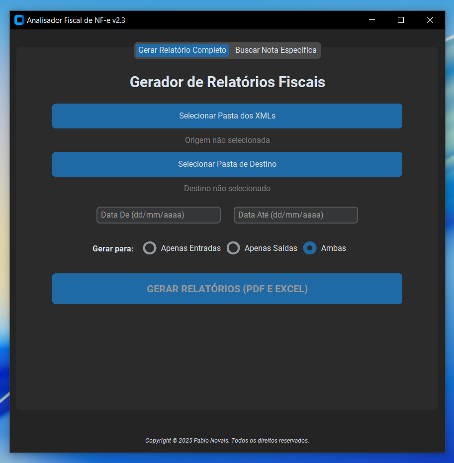

Analisador Fiscal de NF-e
Uma aplicação de desktop desenvolvida em Python para automatizar a análise de arquivos XML de Notas Fiscais Eletrônicas (NF-e). A ferramenta permite que usuários, mesmo sem conhecimento técnico aprofundado, processem lotes de notas fiscais, gerando relatórios detalhados em PDF e Excel.

Screenshot da Aplicação

Analisador Fiscal de NF-e
Uma aplicação de desktop desenvolvida em Python para automatizar a análise de arquivos XML de Notas Fiscais Eletrônicas (NF-e). A ferramenta permite que usuários, mesmo sem conhecimento técnico aprofundado, processem lotes de notas fiscais, gerando relatórios detalhados em PDF e Excel.

Funcionalidades Principais (Features)
Interface Gráfica Intuitiva: Desenvolvida com CustomTkinter para uma experiência de usuário moderna e amigável.

Análise em Lote: Processa múltiplos arquivos XML localizados em uma pasta de origem selecionada pelo usuário.

Classificação Automática: Separa as operações fiscais em Entradas e Saídas com base no primeiro dígito do CFOP.

Filtro por Período: Permite ao usuário definir um intervalo de datas ("De" e "Até") para analisar apenas as notas emitidas nesse período.

Geração de Relatórios Multi-formato:

PDF: Cria um relatório profissional com uma página de resumo (totais de entradas, saídas e impostos) e páginas de detalhes agrupadas por CFOP. Inclui rodapé com autoria e paginação.

Excel: Gera uma planilha .xlsx com abas separadas para Entradas e Saídas, facilitando análises posteriores.

Busca Rápida: Funcionalidade para localizar uma nota fiscal específica pelo seu número e exibir seus detalhes na tela.

Portabilidade: O projeto pode ser compilado em um único arquivo executável (.exe) com PyInstaller, permitindo o uso em qualquer máquina Windows sem a necessidade de instalar Python ou bibliotecas.

*Tecnologias Utilizadas*
Linguagem: Python 3

Interface Gráfica (GUI): CustomTkinter

Manipulação de XML: xml.etree.ElementTree (biblioteca padrão do Python)

Geração de PDF: fpdf2

Geração de Excel: openpyxl

Empacotamento: PyInstaller

Instalação e Uso
Existem duas formas de utilizar este projeto: como um usuário final (usando o .exe) ou como um desenvolvedor (executando o código-fonte).

Para Usuários Finais
Vá para a seção Releases deste repositório.

Baixe a versão mais recente do Analisador.Fiscal.v2.exe.

Execute o arquivo. Não é necessária nenhuma instalação.

Autor
Pablo Novais
github.com/pablo-novais
linkedin.com/in/pablonovaisramos
